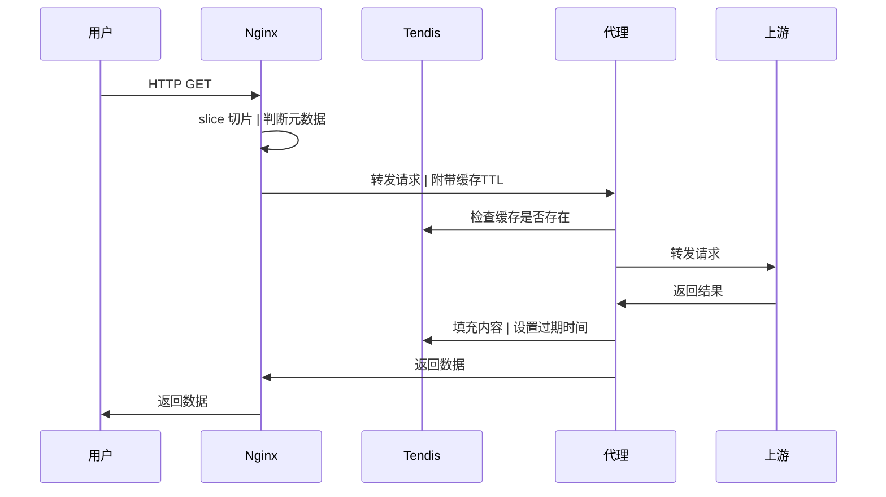

## 代理缓存

实现一个基于Tendis的镜像站缓存

### 为什么是Tendis?

因为想要实现这些目标:
- 按请求路径分片缓存
  > 需要使用KV存储
- 按路径清理缓存
  > 需要实现索引或Key扫描
- 分布式服务端
  > 需要一个存储后端，不能使用嵌入式KV存储


### 配置文件
```yaml
redis:
  # 基础配置
  cluster:  false # bool     Redis集群
  db:       0     # int      DB
  address:  []    # []string Redis地址列表（非集群时取第一个）
  username: ''    # string   用户名
  password: ''    # string   密码

  # 连接配置（可选）
  dial_timeout:       # time.Duration 连接超时
  read_timeout:       # time.Duration 读取超时
  write_timeout:      # time.Duration 写入超时
  max_redirects:      # int           最大重定位
  pool_size:          # int           连接池大小
  pool_timeout:       # time.Duration 获取连接超时
  min_idle_conns:     # int           最小空闲连接数
  max_idle_conns:     # int           最大空闲连接数
  max_active_conns:   # int           最大活跃连接数
  conn_max_idle_time: # time.Duration 空闲连接存活时间
  conn_max_lifetime:  # time.Duration 连接最大存活时间

  items_per_scan: # int64 清理缓存时Scan的批次大小
                  #       性能警告: https://github.com/Tencent/Tendis/issues/460

  # IO配置（可选）
  read_buffer_size:  # int 读缓冲区大小（bytes）
  write_buffer_size: # int 写缓冲区大小（bytes）

servers:
- host:         # string                监听域名
  upstream:     # string                上游地址
  ttl: {}       # map[int]time.Duration 缓存时间键值对
  max_redirect: # bool                  跟随302跳转次数（默认10，0为关闭）
  cache_key:    # string                缓存键构建模板
                ##                      Upstream: 上游完整URL
                ##                      Request:  下游请求体
  redis:        #                       Redis配置（可覆盖全局配置）
  paths:
  - prefix:       # string URL前缀
    expr:         # string 重写URL的正则表达式
    repl:         # string 重写URL的替换字符串
    upstream:     #        上游地址（可覆盖server配置）
    ttl: {}       #        缓存时间键值对（可覆盖server配置）
    max_redirect: #        跟随302跳转次数（可覆盖server配置）
    cache_key:    #        缓存键构建模板（可覆盖server配置）
    redis:        #        Redis配置（可覆盖server配置）
```

### 架构设想


### 请求
| 请求头 | 使用 |
| :- | :- |
| Range | Nginx切片 |
| X-Cache-TTL | 默认缓存时间 |
| X-Cache-TTL-XXX | 状态码缓存时间 |