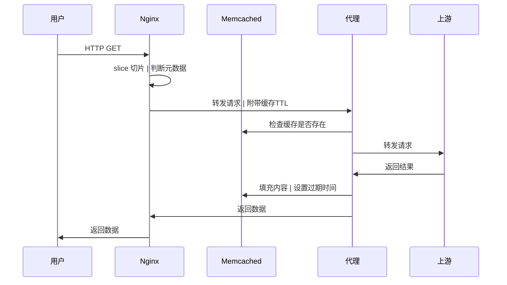

## 代理缓存

实现一个基于Memcached ExtStore的镜像站缓存

### 配置文件
```yaml
memcached:
  address: []       # Memcached地址列表
  hashed:           # 缓存键哈希方法 { md5, sha1, sha224, sha256, sha384, sha512 }
  index_write_back: # 缓存回写间隔

servers:
- host:      # 监听域名
  cache_key: # 缓存键构建模板（根为上游请求的 *http.Request）
  upstream:  # 上游地址
  ttl: {}    # 缓存时间键值对 { StatusCode: time.Duration }
  paths:
  - prefix:   # URL前缀
    upstream: # 上游地址 (覆盖Server)
    expr:     # 重写URL的正则表达式
    repl:     # 重写URL的替换字符串
```

### 架构设想


### 请求
| 请求头 | 使用 |
| :- | :- |
| Range | Nginx切片 |
| X-Cache-TTL | 默认缓存时间 |
| X-Cache-TTL-XXX | 状态码缓存时间 |