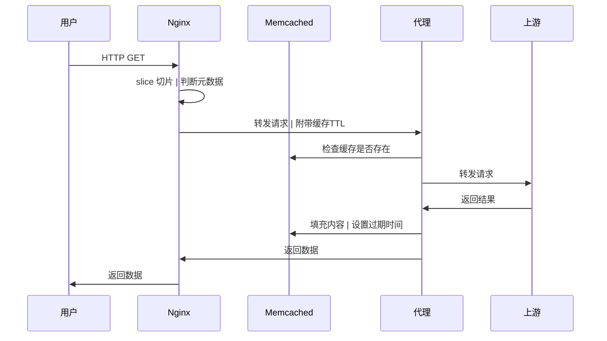

## 代理缓存

### 架构设想

```mermaid
sequenceDiagram
    participant 用户
    participant Nginx
    participant Memcached
    participant 代理
    participant 上游

    用户 ->> Nginx: HTTP GET
    Nginx ->> Nginx: slice 切片 | 判断元数据
    Nginx ->> 代理: 转发请求 | 附带缓存TTL
    代理 ->> Memcached: 检查缓存是否存在
    代理 ->> 上游: 转发请求
    上游 ->> 代理: 返回结果
    代理 ->> Memcached: 填充内容 | 设置过期时间
    代理 ->> Nginx: 返回数据
    Nginx ->> 用户: 返回数据
```

### 规则匹配
1. 主机匹配
2. 路径匹配

### 请求
| 请求头 | 使用 |
| :- | :- |
| Range | Nginx切片 |
| X-Cache-TTL | 默认缓存时间 |
| X-Cache-TTL-XXX | 状态码缓存时间 |